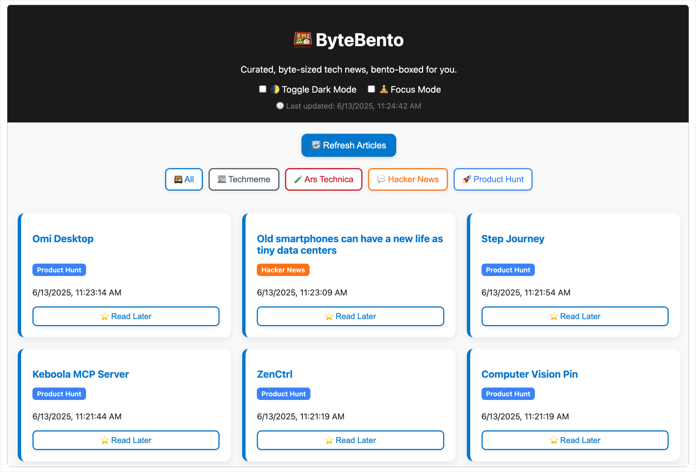

# ByteBento 🍱

[](https://github.com/byte-bento/bytebento/stargazers)
[](https://opensource.org)


<p align="center">
  <a href="https://bytebento.com">
    
  </a>
</p>

**A fast, minimalist tech news aggregator powered by Cloudflare Workers.** ByteBento aggregates headlines in real-time from top tech sources, filters them by publisher, and lets users save articles to read later or export in JSON.

**🔗 Visit the live site:**<br>
[https://bytebento.com](https://bytebento.com)

**☕ If you find ByteBento useful:**<br>
<a href='https://ko-fi.com/O4O81GA31F' target='_blank'>Buy me a coffee at ko-fi.com</a> to help me keep the lights on!

## 📋 Table of Contents

- 🌐 [Demo](#demo)
- ✨ [Features](#features)
- 💻 [Tech Stack](#tech-stack)
- 🏁 [Getting Started](#getting-started)
  - [Prerequisites](#prerequisites)
  - [Installation](#installation)
  - [Development](#development)
  - [Deployment](#deployment)
- 🗺️ [Roadmap](#roadmap)
- 🤝 [Contributing](#contributing)
- 📁 [Repo Structure](#repo-structure)
- 📄 [License](#license)
- 🙏 [Acknowledgements](#acknowledgements)

## Demo

**Screenshot:**
<p align="center">
  
</p>

**GIF:**
<p align="center">
  
</p>

## Features

- 📰 **Real-time headlines** from multiple tech sources (Ars Technica, Hacker News, Product Hunt, etc.)
- 🎛 **Source filtering** for quick focus
- 💾 **Read Later** list with **export/download** functionality
- 🌙 **Dark mode** & **Focus mode** for distraction-free reading
- 🔁 **Graceful fallbacks** if any source is down
- ⚡️ **Lightning-fast** serverless architecture

## Tech Stack

🌀 **Hosted entirely via Cloudflare Workers** – combines serverless API logic and static content delivery in a single deployment.

- **Platform & Hosting:** Cloudflare Workers (API + static assets)
- **Language & Frameworks:** Vanilla JavaScript, HTML, CSS
- **Storage:** Browser LocalStorage
- **Version Control:** Git & GitHub
- **No frameworks, no build step** — just clean, readable code!

## Getting Started

### Prerequisites
- [Node.js](https://nodejs.org/en) (for local Worker simulation, optional)
- [Wrangler CLI](https://developers.cloudflare.com/workers/cli-wrangler/) (install instructions and CLI reference)
- A free [Cloudflare account](https://dash.cloudflare.com/sign-up) with Workers enabled

### Installation

1. **Clone the repo**
```bash
git clone https://github.com/byte-bento/bytebento.git
cd bytebento
```

2. **Install Wrangler (if not already)**
```bash
npm install -g @cloudflare/wrangler
```

### Development
> You can preview the site and Workers locally using Wrangler.

```bash
# Log into Cloudflare
wrangler login
# Simulate Workers + static assets locally
wrangler dev
```

Open [http://127.0.0.1:8787](http://127.0.0.1:8787) in your browser to see live changes.

### Deployment
Once you're happy with changes:
```bash
# Publish to your Cloudflare account
wrangler publish
```

## Roadmap

These features are in the works or on the roadmap - tracked over on the [GitHub Issues](https://github.com/johnnyfivepi/bytebento/issues) page:

- 🔍 Live search to filter articles by keyword
- 🧵 Add more tech news sources (including RSS-based ones)
- 📝 About page or mini changelog to track progress

## Contributing

Want to improve ByteBento or suggest a new feature? Awesome! We welcome all kinds of contributions! To get started:

1. Fork the repo
2. Create a branch (`git checkout -b feature/awesome-thing`)
3. Make your changes & commit with clear messages
4. Push to your fork (`git push origin feature/awesome-thing`)
5. Open a Pull Request against `main`

Be sure to:

- Review [existing issues](https://github.com/byte-bento/bytebento/issues) and add your thoughts
- Label any bugs you find or feature ideas you want to tackle
- Follow consistent code style (ESLint rules if you introduce new JS)

🪄 Whether it’s code, docs, or just ideas - contributions of all kinds are appreciated, so thank you for helping make ByteBento better!

## Repo Structure

<pre>/workers → Cloudflare Worker scripts
/src → Static site content
/scripts → Utility tools (RSS parsing, filtering, etc.)</pre>

## License

This project is licensed under the [MIT License](LICENSE).  
Feel free to use, share, and remix—just give credit where it’s due.

## Acknowledgements

- Inspired by the simplicity of serverless dashboards
- Thanks to Cloudflare Workers for the magic edge compute
- Hats off to all open-source libraries and contributors
- Made with ☕, 🧠, and 💻
